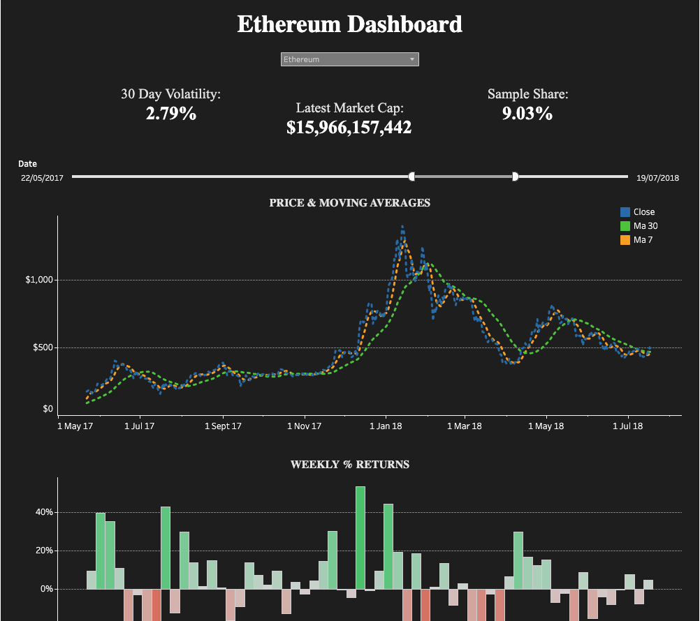

# Crypto Dashboard Project

This repository showcases a simple pipeline for exploring and visualising cryptocurrency market data using **SQL** for data processing and **Tableau** for dashboard creation.  It combines raw price data, a series of SQL queries to compute key metrics, and an interactive Tableau dashboard which can be explored online or recreated locally.

## Repository Structure

```text
/SQL/          # SQL script for cleaning and analysing the data
README.md      # This README
```

- **`SQL/code.sql`** contains SQL statements to create a clean table, derive intermediate views and compute key performance indicators (KPIs) such as daily returns, 30‑day volatility, latest market capitalisation and market dominance.  It also defines a view with 7‑ and 30‑day moving averages used for charting.
- **Tableau dashboard** (link below) uses exported CSVs from the queries above to build interactive visualisations.
- **Screenshot** (see below) gives a quick preview of the dashboard.

## Data

The raw data comprises historical price information for several cryptocurrencies (e.g., Bitcoin, Ethereum).  Each record contains the currency name, trading date, and values for open price, high price, low price, close price, trading volume and market capitalisation.

## SQL Processing

The SQL script performs several key steps:

1. **Table creation** – A table `crypto_clean` is created to hold the raw data with appropriate data types.
2. **Filtering zero values** – A view `crypto_clean_nozero` filters out any records where the open, high, low or close prices are zero, ensuring that downstream calculations are meaningful.
3. **Daily returns** – Using a window function with `LAG`, the script computes the percentage change in closing price from the previous day for each currency.  Results are rounded to two decimal places and stored as a derived column `Daily Return %`.
4. **Key performance indicators (KPIs)** – The view `v_crypto_kpis2` aggregates several metrics:
   - Latest market capitalisation for each currency.
   - 30‑day volatility, calculated as the standard deviation of daily returns over the last 30 days (expressed as a percentage).
   - Market dominance (share), defined as the currency’s market cap divided by the total market cap on the latest date.
5. **Time series with moving averages** – The view `v_price_timeseries` produces rolling 7‑day and 30‑day moving averages of the closing price for each currency, facilitating smoother trend visualisation.

These queries can be executed in a database (e.g., PostgreSQL or SQLite) to generate CSV files which are then loaded into Tableau.

## Tableau Dashboard

An interactive dashboard built in Tableau brings the processed data to life.  You can explore the live version here:

<https://public.tableau.com/app/profile/jesse.rai/viz/CryptoDashboard_17565869209030/Dashboard1>

Key features of the dashboard include:

- **Cryptocurrency selector** – Choose from multiple currencies (e.g., Bitcoin, Ethereum) to update all visualisations simultaneously.
- **Top‑level metrics** – Displayed panels show:
  - **30‑day volatility** (in percent) for the selected currency
  - **Latest market cap** in USD
  - **Sample share** (market dominance) relative to the total crypto market
- **Date slider** – A range slider lets you focus on a specific time window within the available data.
- **Price & moving averages** – The main line chart plots the closing price along with 7‑day and 30‑day moving averages, revealing short‑ and medium‑term trends.
- **Weekly percentage returns** – A bar chart summarises weekly percentage returns, highlighting periods of strong gains or losses.

The Tableau dashboard uses CSV outputs from the SQL script, so results are synchronised with your data processing logic.

## Getting Started

To replicate this project or adapt it to your own data:

1. **Load raw data** – Import your cryptocurrency price data into a relational database.  Ensure columns match the schema defined in the SQL script (`Currency`, `date`, `Open`, `High`, `Low`, `Close`, `Volume`, `Market Cap`).
2. **Run the SQL script** – Execute `SQL/code.sql` in your database environment.  This will create tables and views and produce the KPIs and time series used in the dashboard.
3. **Export to CSV** – From your database, export the results of the relevant views (e.g., `v_crypto_kpis2`, `v_price_timeseries`) into CSV files.
4. **Build/refresh the dashboard** – Open Tableau Desktop or Tableau Public, connect to the exported CSVs, and refresh the data sources.  The interactive dashboard will update automatically.

## Dashboard Preview

Below is a screenshot of the Ethereum view of the dashboard.  It illustrates how the processed data appears in the interactive interface:



## Contributing

Contributions are welcome!  Feel free to fork the repository, improve the SQL scripts or visualisation, and open a pull request.
